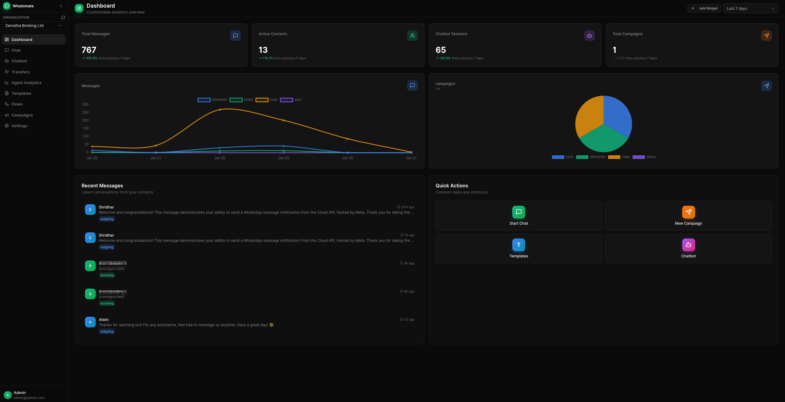
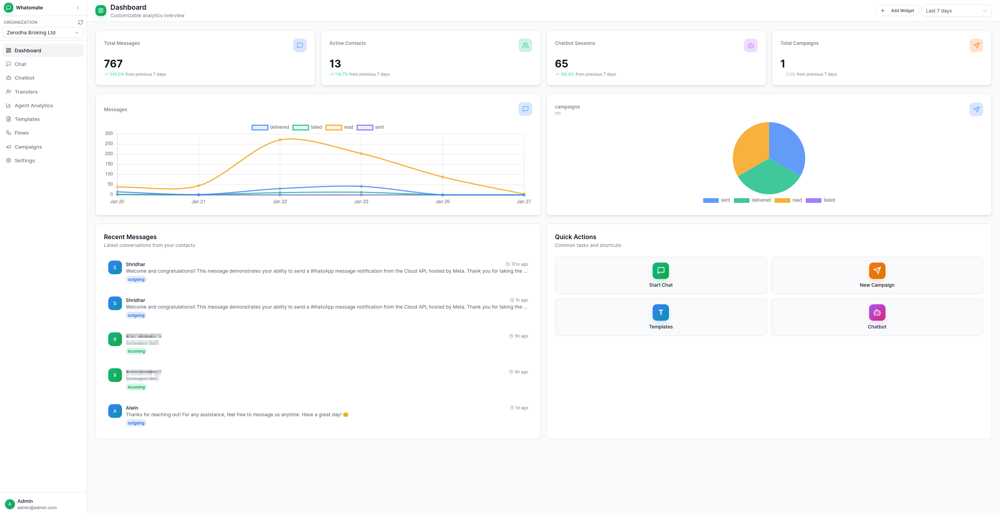
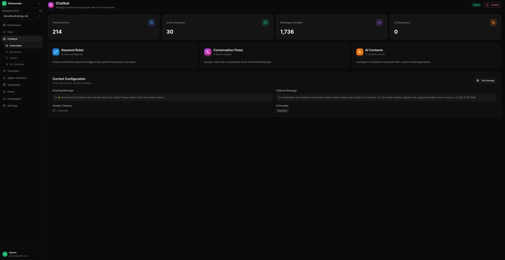
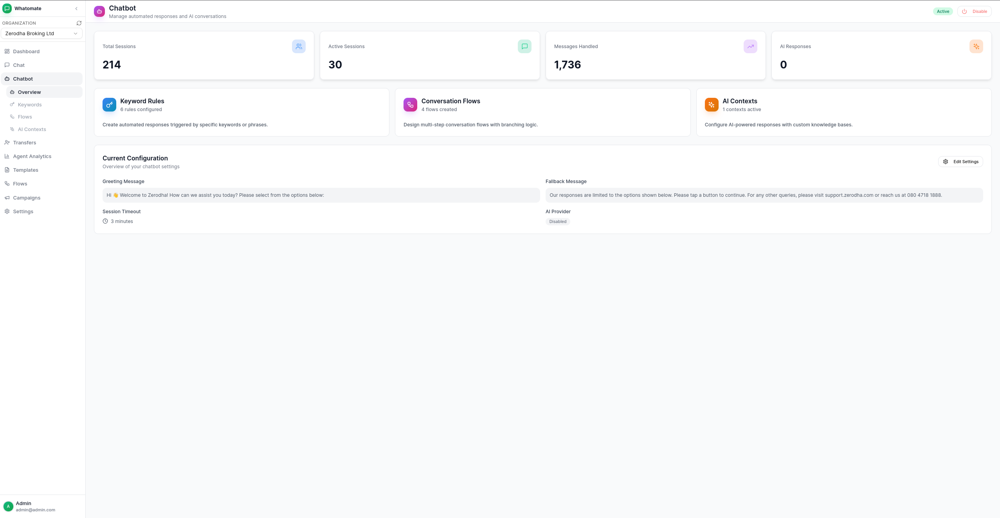
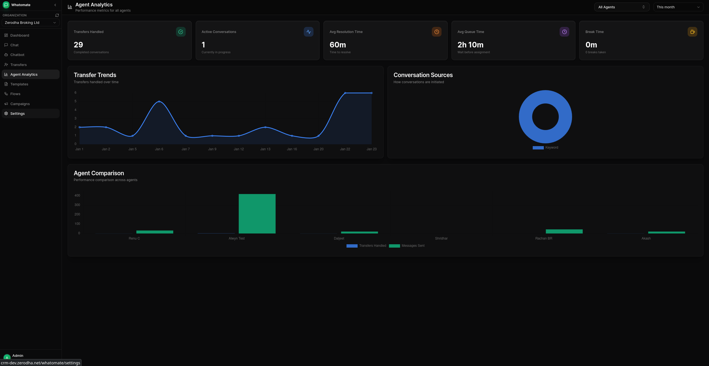
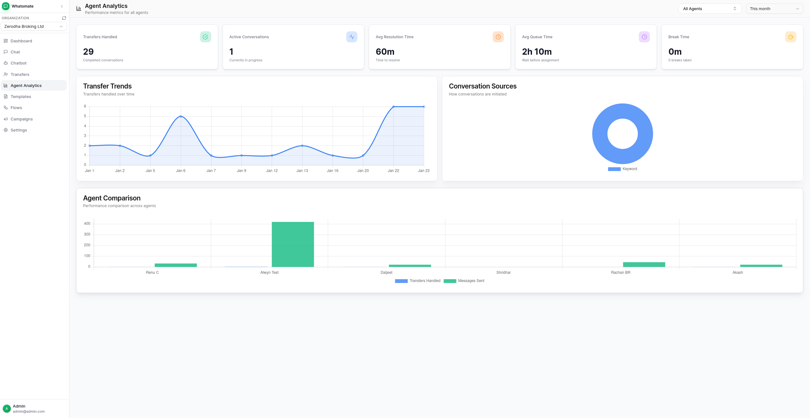
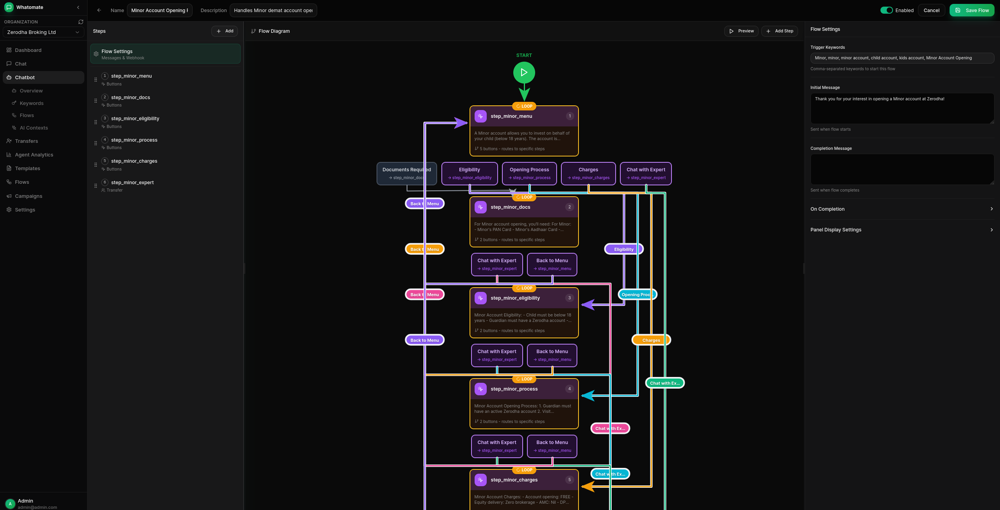
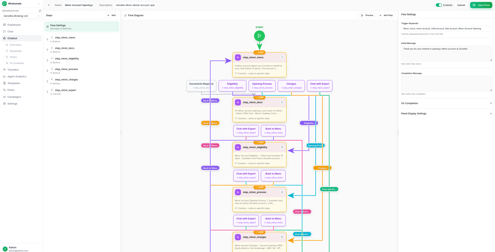

<a href="https://zerodha.tech"></a>

# Whatomate

Modern, open-source WhatsApp Business Platform. Single binary app.



## Features

- **Multi-tenant Architecture**
  Support multiple organizations with isolated data and configurations.

- **Granular Roles & Permissions**
  Customizable roles with fine-grained permissions. Create custom roles, assign specific permissions per resource (users, contacts, templates, etc.), and control access at the action level (read, create, update, delete). Super admins can manage multiple organizations.

- **WhatsApp Cloud API Integration**
  Connect with Meta's WhatsApp Business API for messaging.

- **Real-time Chat**
  Live messaging with WebSocket support for instant communication.

- **Template Management**
  Create and manage message templates approved by Meta.

- **Bulk Campaigns**
  Send campaigns to multiple contacts with retry support for failed messages.

- **Chatbot Automation**
  Keyword-based auto-replies, conversation flows with branching logic, and AI-powered responses (OpenAI, Anthropic, Google).

- **Canned Responses**
  Pre-defined quick replies with slash commands (`/shortcut`) and dynamic placeholders.

- **Analytics Dashboard**
  Track messages, engagement, and campaign performance.

<details>
<summary>View more screenshots</summary>










</details>

## Installation

### Docker

The latest image is available on Docker Hub at [`shridh0r/whatomate:latest`](https://hub.docker.com/r/shridh0r/whatomate)

```bash
# Download compose file and sample config
curl -LO https://raw.githubusercontent.com/shridarpatil/whatomate/main/docker/docker-compose.yml
curl -LO https://raw.githubusercontent.com/shridarpatil/whatomate/main/config.example.toml

# Copy and edit config
cp config.example.toml config.toml

# Run services
docker compose up -d
```

Go to `http://localhost:8080` and login with `admin@admin.com` / `admin`

__________________

### Binary

Download the [latest release](https://github.com/shridarpatil/whatomate/releases) and extract the binary.

```bash
# Copy and edit config
cp config.example.toml config.toml

# Run with migrations
./whatomate server -migrate
```

Go to `http://localhost:8080` and login with `admin@admin.com` / `admin`

__________________

### Build from Source

```bash
git clone https://github.com/shridarpatil/whatomate.git
cd whatomate

# Production build (single binary with embedded frontend)
make build-prod
./whatomate server -migrate
```

See [configuration docs](https://shridarpatil.github.io/whatomate/getting-started/configuration/) for detailed setup options.

## CLI Usage

```bash
./whatomate server              # API + 1 worker (default)
./whatomate server -workers=0   # API only
./whatomate worker -workers=4   # Workers only (for scaling)
./whatomate version             # Show version
```

## Developers

The backend is written in Go ([Fastglue](https://github.com/zerodha/fastglue)) and the frontend is Vue.js 3 with shadcn-vue.
- If you are interested in contributing, please read [CONTRIBUTING.md](./CONTRIBUTING.md) first.

```bash
# Development setup
make run-migrate    # Backend (port 8080)
cd frontend && npm run dev   # Frontend (port 3000)
```

## License

See [LICENSE](LICENSE) for details.
